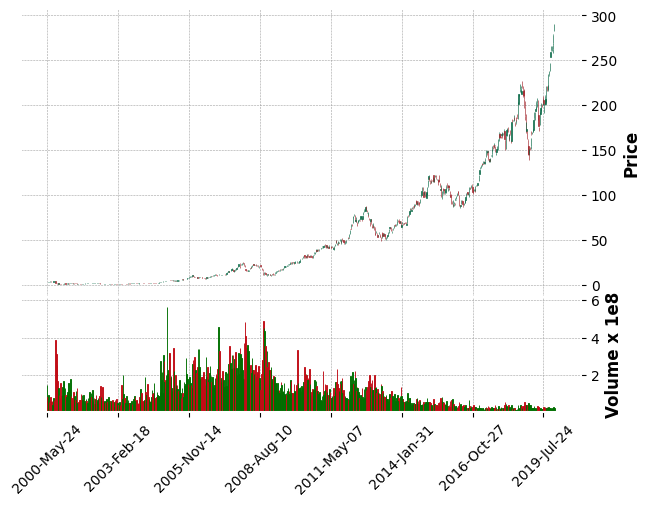
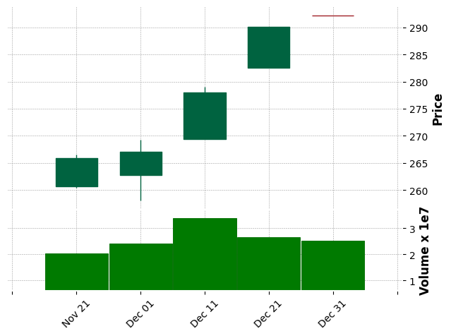
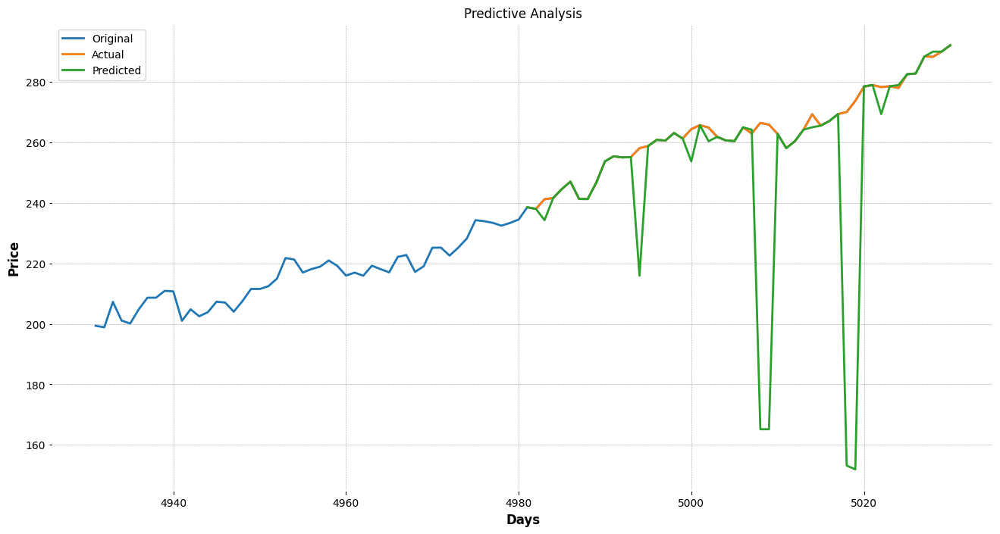

# Stock Price Prediction in Python
## Using Python libraries and packages to import, organize, and visualize the data pertaining to the stocks of a public company provided the ticker and start and end date. I also used Sklearn to make predictions about the closing price.  

## Data Collected
### Example ticker chosen was 'AAPL' to show the Apple stock movement from 2000 till the last trading day of 2019. This is then condensed by getting moving averages and resampling using open, high, low, close practice. 

## Visualization included
+ *Moving Averages and adjusted close price shown on simple graphs*\

+ *Candlestick graph for depicting Open, High, Low, and Close price extracted from the adjusted close price values for a given period*\

## Decision Tree Regressor
### The Decision Tree Regressor builds a classification model in the form of a tree structure. It breaks the dataset down into smaller and smaller subsets while incrementally making decisions. I used the package offered by Sklearn for this. I split the data collected into training and test data. The model was fitted with the training dataset. It gave an accuracy of over 96% for the testing dataset. This is the final visualization of the predictions
\
Documentations Referred to:
+ MPLFinance matplotlib
+ Decision Tree Algorithm

Youtubers Referred to learn the skills in this project:
+ Computer Science
+ Sentdex
